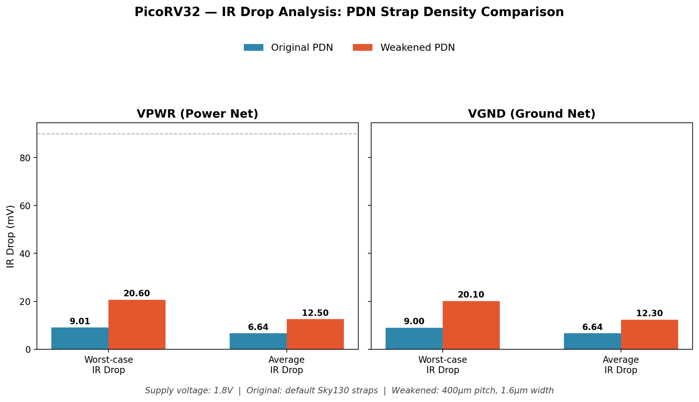

# PicoRV32 — IR Drop Analysis Report

## 1. Objective

The RTL-to-GDSII flow for PicoRV32 (Sky130, OpenLane) produced a design with zero DRC violations and clean timing closure. Passing these signoff checks confirms the design is physically manufacturable and functionally timing-correct, but neither check verifies that the **power distribution network (PDN)** can actually sustain the design's switching activity without excessive voltage droop.

This analysis uses OpenROAD's **PSM (Power/Static IR-drop analysis)** tool to:
1. Quantify the IR drop in the signed-off PDN
2. Identify the physical location of the worst-case voltage drop
3. Deliberately weaken the PDN and re-measure, to establish how much margin the original design has

## 2. Methodology

### 2.1 Inputs used

All files were taken directly from the completed OpenLane run — no re-synthesis, placement, or routing was performed for the baseline analysis.

| Input | Purpose | Source |
|---|---|---|
| Merged LEF | Cell/layer geometry | `tmp/merged.nom.lef` |
| Final DEF | Placement, routing, PDN | `results/final/def/picorv32.def` |
| Liberty (`tt_025C_1v80`) | Cell power/timing characterization | Sky130 PDK |
| SPEF | Extracted parasitic resistance/capacitance of real routed nets | `results/final/spef/picorv32.spef` |
| SDC | Clock period (needed for realistic switching current estimation) | `results/final/sdc/picorv32.sdc` |

Using SPEF (rather than a vectorless/idealized resistance model) means the analysis reflects the actual resistance of the routed metal in this specific layout, not a generic estimate.

### 2.2 Analysis flow (OpenROAD PSM)

```tcl
read_lef <merged.nom.lef>
read_def <picorv32.def>
read_liberty <sky130_fd_sc_hd__tt_025C_1v80.lib>
read_sdc <picorv32.sdc>
read_spef <picorv32.spef>
set_propagated_clock [all_clocks]

analyze_power_grid -net VPWR -outfile irdrop_baseline_vpwr.rpt
analyze_power_grid -net VGND -outfile irdrop_baseline_vgnd.rpt
```

**Note on `read_sdc`:** the clock constraint file was required for meaningful results. Without it, OpenSTA (which PSM relies on internally) has no defined clock, so sequential logic is treated as never switching — producing artificially near-zero (nanovolt-scale) drop values. Loading the SDC and calling `set_propagated_clock` fixed this and produced realistic, millivolt-scale results.

**Note on VSRC:** no explicit power pad/bump location file was provided (this is a core-only macro, not a padded/packaged design), so PSM defaulted to a checkerboard voltage-source pattern across the core area. This is a standard approach for core-level analysis but means absolute values here are representative rather than pad-accurate — a full chip-level signoff would use real pad/bump coordinates.

## 3. Baseline results (original PDN)

```
VPWR:
  Worst-case voltage : 1.79 V
  Average IR drop     : 6.64 mV
  Worst-case IR drop  : 9.01 mV

VGND:
  Worst-case IR drop  : 9.00 mV
  Average IR drop      : 6.64 mV
```

Supply voltage is 1.8 V, so the worst-case drop represents **~0.50%** of VDD — well within the typical industry guideline of keeping IR drop under 5–10% of supply.

### 3.1 Worst-case node location

Sorting the per-instance voltage report by lowest voltage identified the worst-case cluster at:

```
Location: (393.04, 454.24)
Voltage:  1.79099 V  (9.01 mV drop)
```

Several standard cell instances at this exact coordinate share the same worst-case value, including a clock buffer instance (`clkbuf_leaf_99_clk`). This is consistent with expected behavior — clock buffers switch every cycle and draw more dynamic current per unit time than typical combinational logic, making them a natural hotspot for local voltage droop.

## 4. Weakened PDN variant

To quantify how much margin the original PDN provides, a second design variant (`picorv32_weakpdn`) was created with deliberately sparser and thinner power straps, and run through the **full** OpenLane flow (synthesis through signoff) to produce a comparable, fully signed-off DEF/SPEF pair.

### 4.1 Configuration change

| Parameter | Original | Weakened |
|---|---|---|
| `FP_PDN_VPITCH` | Sky130 default (~150 µm) | 400 µm |
| `FP_PDN_HPITCH` | Sky130 default (~150 µm) | 400 µm |
| `FP_PDN_VWIDTH` | Sky130 default (~3–4 µm) | 1.6 µm |
| `FP_PDN_HWIDTH` | Sky130 default (~3–4 µm) | 1.6 µm |

This roughly **2.7× increases strap pitch** (fewer straps, more current per strap) and **halves strap width** (thinner, higher resistance per strap) — both changes push in the same direction toward a weaker grid.

### 4.2 Flow result

The weakened-PDN variant completed the full OpenLane flow cleanly:
- 0 DRC violations
- 0 LVS mismatches
- Clean XOR check between Magic and KLayout GDS

However, it did introduce **max fanout violations** at the typical corner (absent in the original run) — a secondary signal that PDN density choices can have knock-on effects on routing/timing beyond power integrity alone.

### 4.3 Weakened PDN results

```
VPWR:
  Worst-case voltage : 1.78 V
  Average IR drop     : 12.5 mV
  Worst-case IR drop  : 20.6 mV

VGND:
  Worst-case IR drop  : 20.1 mV
  Average IR drop      : 12.3 mV
```

## 5. Comparison

| Metric | Original PDN | Weakened PDN | Change |
|---|---|---|---|
| Worst-case IR drop (VPWR) | 9.01 mV | 20.6 mV | +129% |
| Average IR drop (VPWR) | 6.64 mV | 12.5 mV | +88% |
| Worst-case IR drop (VGND) | 9.00 mV | 20.1 mV | +123% |
| % of 1.8 V supply (worst-case) | ~0.50% | ~1.14% | 2.3× worse |
| PDN nodes on VPWR | 7,104 | 5,504 | 22% fewer |
| DRC / LVS | Clean | Clean | — |
| Timing | Clean | Max fanout violations | New issue introduced |



## 6. Discussion

- **The original signed-off PDN has healthy margin.** A 0.50% worst-case drop leaves substantial headroom before approaching typical 5–10% guidelines, suggesting the Sky130 default PDN parameters (as inherited via OpenLane) are well-suited to a design of PicoRV32's size and switching activity at this clock frequency.
- **PDN density has a direct, near-linear relationship with IR drop in this experiment** — roughly halving strap density and width nearly doubled both worst-case and average IR drop, in both the power and ground networks symmetrically.
- **Even the weakened case remains within nominal guidelines** (1.14% of VDD). This is not evidence that PDN density doesn't matter — rather, it reflects that PicoRV32 is a small, relatively low-power core at a modest clock frequency (40 MHz). A denser, higher-frequency, or larger design would likely show a more dramatic effect from the same relative PDN weakening, and would be a natural extension of this study.
- **The appearance of new fanout violations** in the weakened variant, despite unchanged logic and clock constraints, illustrates that PDN configuration choices aren't isolated from the rest of the physical design flow — sparser power grids can affect routing resource availability in ways that show up as timing or DRC issues elsewhere.

## 7. Conclusion

The PicoRV32 physical design's power distribution network was validated as electrically healthy under static analysis, with approximately 2× margin demonstrated relative to a deliberately weakened PDN configuration. This confirms both that the original signoff was robust and that PDN strap density is a meaningful, controllable lever in physical design — directly trading off power integrity, routing congestion, and (potentially) area.

## 8. Tools & Files

- **Tool:** OpenROAD `psm` (Power/Static IR-drop analysis), invoked via `analyze_power_grid`
- **Flow:** OpenLane v1.0.2, Sky130A PDK, `sky130_fd_sc_hd` standard cell library
- **Scripts:** [`baseline_irdrop.tcl`](baseline_irdrop.tcl), [`weak_irdrop.tcl`](weak_irdrop.tcl)
- **Raw reports:** [`reports/`](reports/)
