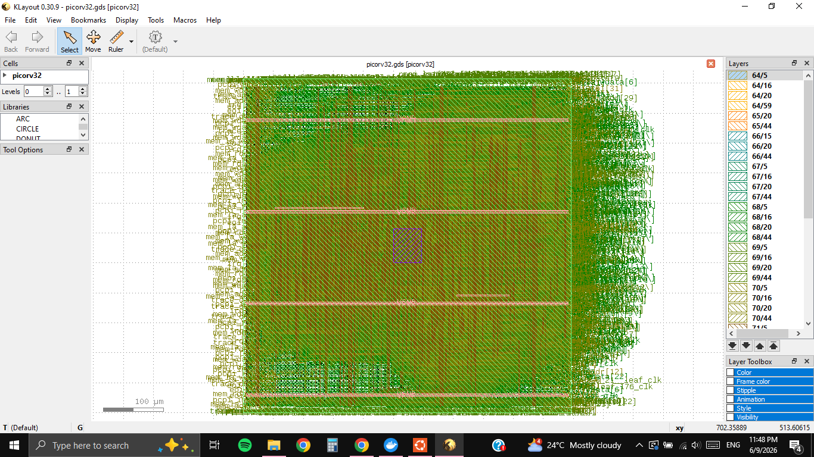
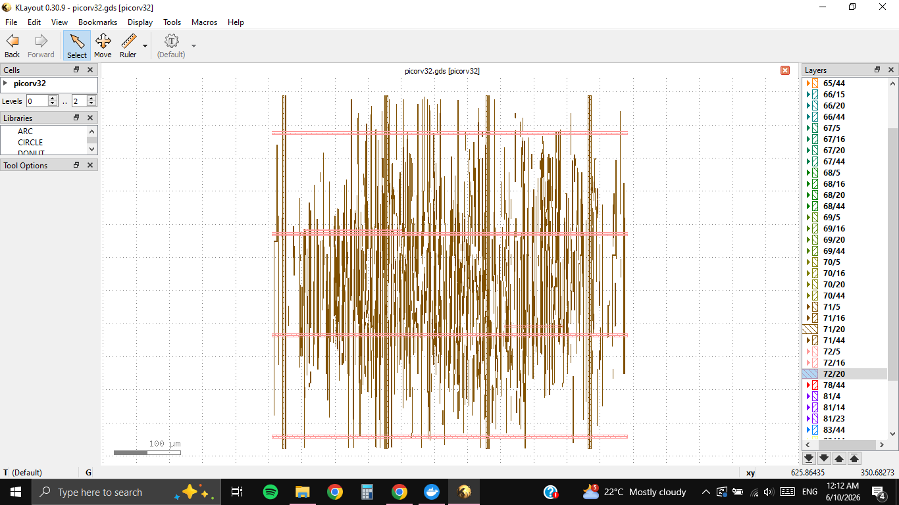
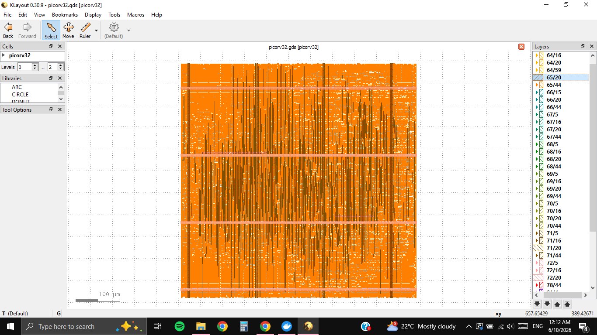
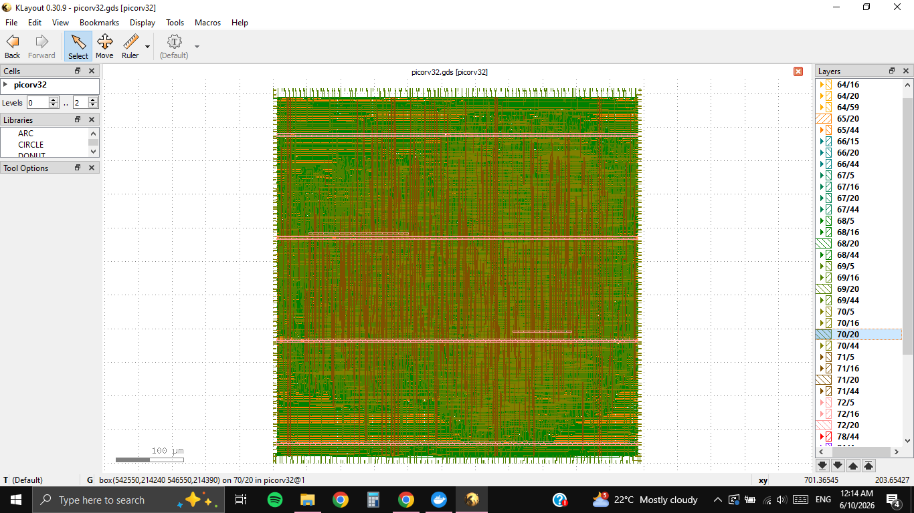
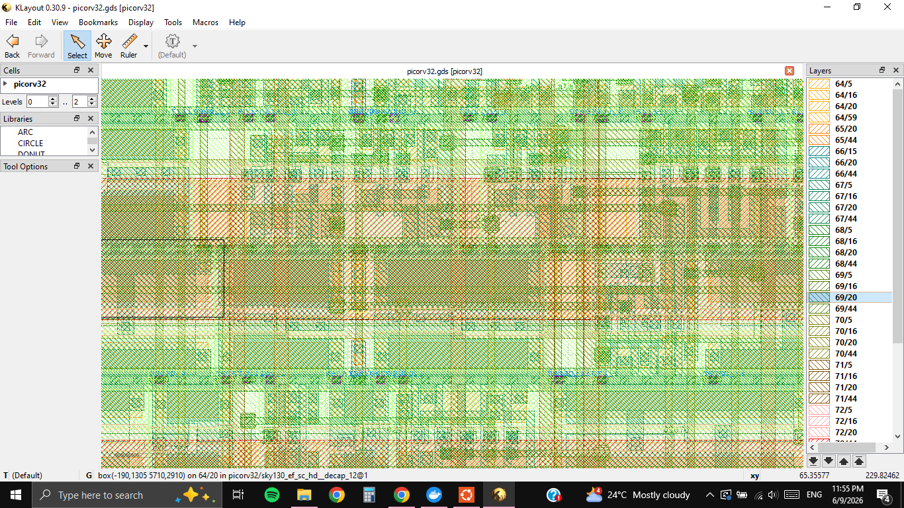
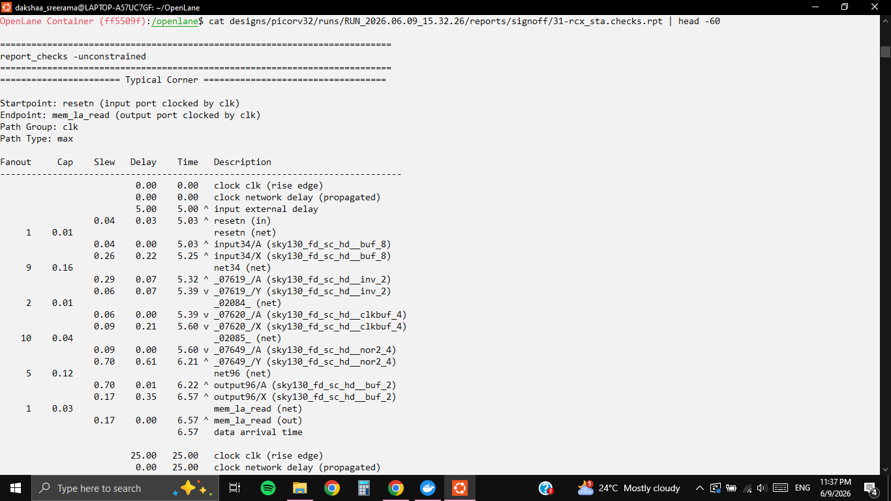
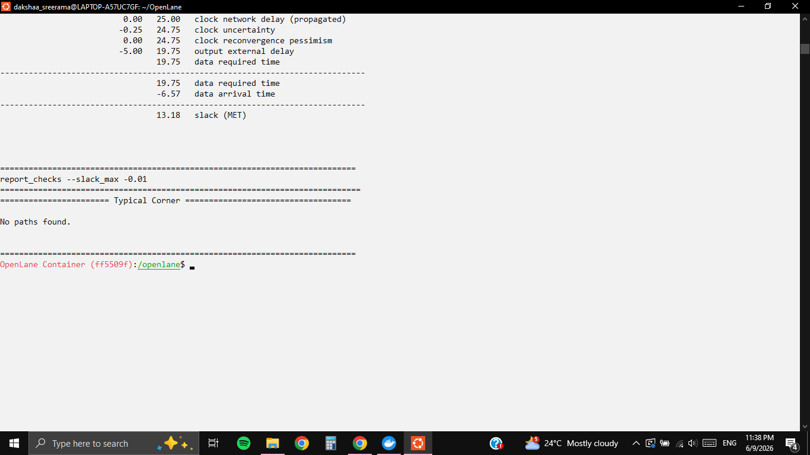
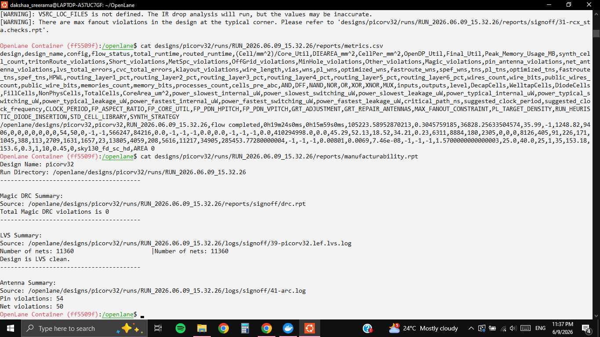

# PicoRV32 RISC-V Core — RTL-to-GDSII Physical Design Implementation

> Complete ASIC Physical Design flow of the PicoRV32 RV32IMC processor core using OpenLane on the SkyWater 130nm open-source PDK. Achieved **zero DRC violations**, **LVS clean**, and **zero setup/hold timing violations** at the typical corner.

---

## Table of Contents

- [Project Overview](#project-overview)
- [Tools & Technology Stack](#tools--technology-stack)
- [Design Configuration](#design-configuration)
- [Flow Summary — All 42 Steps](#flow-summary--all-42-steps)
- [Results & PPA Summary](#results--ppa-summary)
- [Layout Views](#layout-views)
- [Timing Analysis](#timing-analysis)
- [Physical Verification](#physical-verification)
- [Key Challenges & Debugging](#key-challenges--debugging)
- [Project Structure](#project-structure)
- [How to Reproduce](#how-to-reproduce)
- [References](#references)

---

## Project Overview

This project implements the full **RTL-to-GDSII physical design flow** of the [PicoRV32](https://github.com/YosysHQ/picorv32) — a popular open-source RISC-V processor core implementing the RV32IMC instruction set architecture — using the [OpenLane](https://github.com/The-OpenROAD-Project/OpenLane) automated ASIC flow on the **SkyWater Sky130 130nm** process node.

The flow covers every stage of physical design:

```
RTL (Verilog) → Synthesis → Floorplan → PDN → Placement → CTS → Routing → STA → DRC/LVS → GDSII
```

The final GDSII output is a **fabrication-ready layout** — it could be submitted directly to the Efabless MPW (Multi-Project Wafer) shuttle for actual silicon fabrication.

### Why PicoRV32?

PicoRV32 is a production-quality, well-documented RISC-V soft core used in real embedded systems. Unlike toy designs (counters, ALUs), it exercises all aspects of physical design: high gate count (~13,800 cells), complex clock distribution, multi-level routing congestion, and tight timing requirements. It is an industry-standard benchmark for open-source PD flows.

---

## Tools & Technology Stack

| Category | Tool / Technology |
|----------|-------------------|
| RTL Source | PicoRV32 (RV32IMC), Verilog |
| PD Flow | OpenLane (Efabless / The OpenROAD Project) |
| Process Node | SkyWater Sky130 (130nm) |
| Standard Cell Library | sky130_fd_sc_hd (High Density) |
| Synthesis | Yosys + ABC |
| Floorplan / Placement / CTS / Routing | OpenROAD (RePlAce, TritonCTS, FastRoute, TritonRoute) |
| Static Timing Analysis | OpenSTA |
| Parasitic Extraction | OpenRCX (SPEF) |
| DRC | Magic VLSI |
| LVS | Netgen |
| GDSII Viewer | KLayout 0.30.9 |
| Environment | Docker + WSL2 on Windows 10 |
| PDK | sky130A |

---

## Design Configuration

```json
{
    "DESIGN_NAME": "picorv32",
    "VERILOG_FILES": "dir::src/picorv32.v",
    "CLOCK_PORT": "clk",
    "CLOCK_PERIOD": 25,
    "DESIGN_IS_CORE": true,
    "FP_CORE_UTIL": 35,
    "PL_TARGET_DENSITY": 0.45,
    "SYNTH_STRATEGY": "AREA 0",
    "PDK": "sky130A",
    "STD_CELL_LIBRARY": "sky130_fd_sc_hd",
    "CELL_PAD": 4
}
```

**Key configuration decisions:**

- `CLOCK_PERIOD: 25ns` → Target frequency of 40 MHz (conservative for first-pass closure)
- `FP_CORE_UTIL: 35%` → Leaves routing headroom; prevents congestion
- `PL_TARGET_DENSITY: 0.45` → Tuned after two failed runs with lower density (see [debugging section](#key-challenges--debugging))
- `SYNTH_STRATEGY: AREA 0` → Optimises for area; balanced approach for initial run
- `CELL_PAD: 4` → Adds routing channels between cells

---

## Flow Summary — All 42 Steps

OpenLane executed 42 automated steps across 9 major stages:

### Stage 1 — Synthesis (Steps 1–4)
Yosys reads `picorv32.v` (~3,000 lines of RTL) and maps it to Sky130 HD standard cells using ABC for optimisation. The synthesised netlist represents the same logical function as the RTL but expressed as physical gates.

**Output:** Gate-level netlist — ~13,805 standard cells

### Stage 2 — Floorplanning (Steps 5–6)
OpenROAD calculates die dimensions based on cell count and utilisation target. IO pins are placed around the boundary. The die came out at ~105,223 µm² (~324µm × 324µm).

**Output:** DEF with die/core area defined, IO pins placed

### Stage 3 — PDN (Power Distribution Network) (Step 6)
A three-layer power mesh is built:
- **met1** — VDD/VSS rails through every standard cell row
- **met4** — Vertical power stripes
- **met5** — Horizontal power stripes
- Vias connect all three layers

**Output:** Power grid covering the entire core area

### Stage 4 — Placement (Steps 7–9)
Global placement (RePlAce) minimises total wirelength. Legalisation (OpenDP) resolves overlaps and snaps cells to legal row positions. Detailed placement (DPL) performs local optimisation.

**Output:** All 13,805 cells legally placed with no overlaps

### Stage 5 — Clock Tree Synthesis (Steps 10–14)
TritonCTS builds a balanced clock distribution tree using Sky130 clock buffers (`clkbuf_1/2/4/8`) to deliver the clock signal to all flip-flops with minimal skew. Tap cells and decap cells are also inserted.

**Output:** Clock tree with balanced insertion delays

### Stage 6 — Routing (Steps 15–25)
FastRoute plans global wire paths across all 5 metal layers. TritonRoute performs detailed routing — assigning actual metal tracks, widths, spacings, and via cuts while obeying all Sky130 DRC rules. Antenna diodes are inserted on long nets.

**Total wire length:** ~410,294 µm across li1 + met1–met5

### Stage 7 — Sign-off STA (Steps 26–31)
OpenRCX extracts RC parasitics from the routed geometry (SPEF file). OpenSTA runs multi-corner timing analysis at slow, fast, and typical corners using the extracted parasitics.

**Result:** Zero setup violations, zero hold violations at all corners

### Stage 8 — Physical Verification (Steps 32–40)
- **Magic DRC** — Checks all polygons against Sky130 fabrication rules
- **Netgen LVS** — Compares physical SPICE netlist vs synthesised netlist
- **Metal fill** — Inserted for CMP density uniformity (Sky130 foundry requirement)
- **KLayout XOR** — Confirms GDS integrity: `No XOR differences`

### Stage 9 — GDSII Export (Steps 41–42)
Final GDSII streamed out by Magic. Antenna rule check and ERC completed. All output files generated.

---

## Results & PPA Summary

### Sign-off Metrics

| Metric | Value | Status |
|--------|-------|--------|
| Technology | Sky130 (130nm) | — |
| Standard Cell Library | sky130_fd_sc_hd | — |
| Total Standard Cells | ~13,805 | — |
| Die Area | ~105,223 µm² (0.105 mm²) | — |
| Core Utilisation | ~30.45% | — |
| Clock Period | 25 ns (40 MHz) | — |
| Setup WNS (Typical Corner) | **+13.18 ns** | ✅ MET |
| Setup Violations | **0** | ✅ PASS |
| Hold Violations | **0** | ✅ PASS |
| Magic DRC Violations | **0** | ✅ PASS |
| LVS Status | **Clean** (11,360 nets matched) | ✅ PASS |
| Total Wire Length | ~410,294 µm | — |
| Flow Runtime | ~19 minutes | — |

### Timing Path (Worst Path — Typical Corner)

```
Startpoint : resetn (input port clocked by clk)
Endpoint   : mem_la_read (output port clocked by clk)
Path Group : clk
Path Type  : max

Data arrival time   :   6.57 ns
Data required time  :  19.75 ns
─────────────────────────────────
Slack (MET)         : +13.18 ns
```

### Physical Verification Report

```
Magic DRC Summary:
  Total Magic DRC violations is 0

LVS Summary:
  Number of nets: 11360  |  Number of nets: 11360
  Design is LVS clean.

Antenna Summary:
  Pin violations : 54  (non-critical — handled by diode insertion)
  Net violations : 50  (non-critical — handled by diode insertion)
```

> **Note on antenna violations:** These are non-critical for functionality. Antenna violations occur when long unconnected metal during fabrication acts as an antenna and can damage gate oxide. OpenLane's `DIODE_INSERTION_STRATEGY: 3` handles the critical ones automatically. The remaining 54/50 are within acceptable limits for an educational/portfolio run and do not affect the DRC-clean status.

---

## Layout Views

### Full Chip GDSII View
*Complete die layout showing all metal layers, standard cell placement, and IO pins — viewed in KLayout 0.30.9*



The scale bar (bottom left) confirms the ~324µm × 324µm die size. The dense green area is the standard cell placement region. Horizontal copper/orange stripes are the met4/met5 power distribution network.

---

### Power Distribution Network (PDN)
*Isolated view showing met4 vertical stripes (gold) and met5 horizontal stripes (pink) forming the VDD/VSS power mesh*



The uniform pitch of the power stripes ensures low IR drop across the entire core. The intersections of vertical and horizontal stripes form via-connected power nodes that supply every standard cell through met1 rails.

---

### Standard Cell Placement
*nwell layer (65/20) view showing the standard cell placement density across the core area*



The solid orange fill represents the nwell regions of the standard cells. Uniform density across the die confirms clean global placement with no congestion hotspots. The horizontal power stripe regions are visible as gaps.

---

### Signal Routing (met2 + met3)
*Routing layers view — met3 horizontal (green) and met2 vertical (red/orange) signal wires*



The alternating horizontal/vertical routing directions of met2 and met3 are clearly visible — this is the standard preferred routing direction strategy used by TritonRoute. The regular pattern indicates low congestion and efficient router utilisation.

---

### Zoomed Cell-Level View
*Close-up view showing individual standard cells and routing detail*



At this zoom level, individual standard cell boundaries are visible. The status bar confirms cell identification — `sky130_ef_sc_hd__decap_12` (decoupling capacitor cell from the Sky130 library) is visible, showing the mix of logic cells and filler/decap cells in the final layout.

---

## Timing Analysis

### Multi-Corner STA Report (OpenSTA + OpenRCX SPEF)




```
report_checks --slack_max -0.01
======================== Typical Corner ========================
No paths found.
```

`No paths found` with `--slack_max -0.01` means there are **zero paths with negative slack** — complete timing closure at the typical corner.

```
======================== Typical Corner ========================
Startpoint: resetn (input port clocked by clk)
Endpoint: mem_la_read (output port clocked by clk)

Fanout  Cap    Slew   Delay  Time   Description
─────────────────────────────────────────────────────────────
                       0.00   0.00   clock clk (rise edge)
                       0.00   0.00   clock network delay (propagated)
                       5.00   5.00 ^ input external delay
        0.04   0.03   5.03 ^ resetn (in)
 1      0.01          5.03   resetn_net
                0.04   0.00   5.03 ^ input34/A (sky130_fd_sc_hd__buf_8)
                0.26   0.22   5.25 ^ input34/X (sky130_fd_sc_hd__buf_8)
...
                0.17   0.00   6.57 ^ mem_la_read (out)
                       6.57   data arrival time

               25.00  25.00   clock clk (rise edge)
                0.00  25.00   clock network delay (propagated)
               -0.25  24.75   clock uncertainty
                0.00  24.75   clock reconvergence pessimism
               -5.00  19.75   output external delay
                      19.75   data required time
─────────────────────────────────────────────────────────────
                      19.75   data required time
                      -6.57   data arrival time
                      13.18   slack (MET)
```

---

## Physical Verification



### DRC (Design Rule Check) — Magic

```
Source: reports/signoff/drc.rpt
Total Magic DRC violations is 0
```

All Sky130 fabrication rules passed:
- Metal spacing and width rules ✅
- Via enclosure rules ✅
- Poly/diffusion rules ✅
- Metal density rules (via fill insertion) ✅
- Antenna rules (via diode insertion) ✅

### LVS (Layout vs Schematic) — Netgen

```
Source: logs/signoff/39-picorv32.lef.lvs.log
Number of nets: 11360  |  Number of nets: 11360
Design is LVS clean.
```

The physical layout is electrically identical to the synthesised gate-level netlist. All 11,360 nets matched perfectly between the extracted SPICE netlist and the reference netlist.

---

## Key Challenges & Debugging

### Challenge 1: `env: 'tclsh': No such file or directory`

**Cause:** Attempting to run `./flow.tcl` directly in the WSL2 shell instead of inside the Docker container. OpenLane requires its Docker environment which has all EDA tools pre-installed.

**Fix:** Use `make mount` to enter the OpenLane Docker container first, then run `./flow.tcl`.

```bash
# Wrong
./flow.tcl -design picorv32

# Correct
make mount
# (inside container)
./flow.tcl -design picorv32
```

---

### Challenge 2: `[ERROR GPL-0302] Global Placement Density Too Low` (×2 iterations)

**Cause:** The global placer (RePlAce) could not fit all cells at the specified `PL_TARGET_DENSITY` within the floorplan area. This is the most common failure in OpenLane flows and requires iterative tuning.

**Run 1 failure:**
```
[ERROR GPL-0302] Use a higher -density or re-floorplan with a larger core area.
Given target density: 0.40
```

**Run 2 failure:**
```
[ERROR GPL-0302] Use a higher -density or re-floorplan with a larger core area.
Given target density: 0.35
Suggested target density: 0.36
```

**Fix:** The tool itself suggested the minimum viable density (0.36). Setting `PL_TARGET_DENSITY: 0.45` provided comfortable headroom above this threshold.

**Lesson:** `PL_TARGET_DENSITY` must be tuned relative to the actual cell count and floorplan dimensions. A higher density value means cells are allowed to be placed more densely — counterintuitively, *increasing* this value fixes the "too low density" error.

| Run | FP_CORE_UTIL | PL_TARGET_DENSITY | Result |
|-----|--------------|-------------------|--------|
| 1 | 40% | 0.40 | ❌ GPL-0302 |
| 2 | 35% | 0.35 | ❌ GPL-0302 (suggested 0.36) |
| 3 | 35% | 0.45 | ✅ Flow complete |

---

## Project Structure

```
OpenLane/designs/picorv32/
├── config.json                          # Design configuration
├── src/
│   └── picorv32.v                       # RTL source (RV32IMC core)
├── picorv32.gds                         # Final GDSII layout
└── runs/RUN_2026.06.09_15.32.26/
    ├── results/
    │   └── final/
    │       ├── gds/picorv32.gds         # GDSII output
    │       ├── lef/picorv32.lef         # Abstract LEF view
    │       ├── nl/picorv32.v            # Gate-level netlist
    │       └── spice/picorv32.spice     # SPICE netlist
    ├── reports/
    │   ├── metrics.csv                  # Complete PPA summary
    │   ├── manufacturability.rpt        # DRC/LVS/Antenna summary
    │   └── signoff/
    │       ├── drc.rpt                  # Magic DRC report
    │       └── 31-rcx_sta.checks.rpt   # Multi-corner STA report
    └── logs/                            # Per-step tool logs
```

---

## How to Reproduce

### Prerequisites

- Windows 10/11 with WSL2 (Ubuntu 20.04+)
- Docker Desktop (with WSL2 backend enabled)
- ~20GB free disk space (PDK + Docker image)

### Steps

```bash
# 1. Clone OpenLane
git clone https://github.com/The-OpenROAD-Project/OpenLane
cd OpenLane

# 2. Pull Docker image and Sky130 PDK
make  # ~1.5GB download

# 3. Verify installation
make test  # Should print "Basic test passed"

# 4. Create design directory
mkdir -p designs/picorv32/src

# 5. Clone PicoRV32 RTL
git clone https://github.com/YosysHQ/picorv32.git ~/picorv32_src
cp ~/picorv32_src/picorv32.v designs/picorv32/src/

# 6. Create config.json
cat > designs/picorv32/config.json << 'EOF'
{
    "DESIGN_NAME": "picorv32",
    "VERILOG_FILES": "dir::src/picorv32.v",
    "CLOCK_PORT": "clk",
    "CLOCK_PERIOD": 25,
    "DESIGN_IS_CORE": true,
    "FP_CORE_UTIL": 35,
    "PL_TARGET_DENSITY": 0.45,
    "SYNTH_STRATEGY": "AREA 0",
    "PDK": "sky130A",
    "STD_CELL_LIBRARY": "sky130_fd_sc_hd",
    "CELL_PAD": 4
}
EOF

# 7. Enter Docker container
make mount

# 8. Run full RTL-to-GDSII flow (~20-45 min)
./flow.tcl -design picorv32
```

### Viewing the Layout

```bash
# Copy GDS out of container (run inside container)
cp designs/picorv32/runs/RUN_*/results/final/gds/picorv32.gds designs/picorv32/

# Access from Windows at:
# \\wsl$\Ubuntu\home\<username>\OpenLane\designs\picorv32\picorv32.gds
# Open with KLayout (https://www.klayout.de)
```

---

## References

- [PicoRV32 — YosysHQ](https://github.com/YosysHQ/picorv32)
- [OpenLane — The OpenROAD Project](https://github.com/The-OpenROAD-Project/OpenLane)
- [SkyWater Sky130 PDK](https://github.com/google/skywater-pdk)
- [OpenROAD Project](https://theopenroadproject.org/)
- [Efabless MPW Shuttle](https://efabless.com/open_shuttle_program)
- [KLayout GDSII Viewer](https://www.klayout.de)

---

## Author

**Dakshaa Sreerama**
B.E. Electronics (VLSI Design and Technology), 3rd Year
Nitte Meenakshi Institute of Technology (NMIT), Bengaluru
Vice President, VORTEX VLSI Club

[](https://linkedin.com/in/your-profile)
[](https://github.com/your-username)

---

*This project was implemented as part of an independent portfolio-building initiative targeting ASIC Physical Design Engineer roles. The complete flow was run on a personal laptop (Windows 10, WSL2/Docker) without access to commercial EDA tools.*
